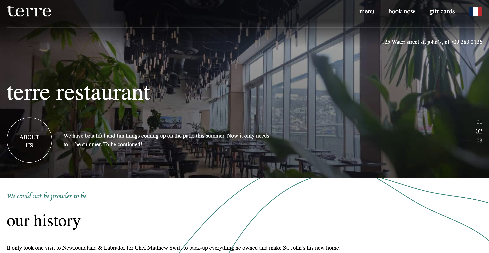

# Terre Restaurant Landing Page

## Overview

This project is a test task for creating a landing page for "Terre," a restaurant located in Canada. The landing page features an adaptive design and includes essential sections such as navigation menu, history of the restaurant, timetable, a booking form, and contact information.

## Technologies Used

`TypeScript` `Next.js` `Tailwind CSS` `Zod` `React-toastify` `React-hook-form`

## Deployment

The project is deployed on Vercel for easy hosting and access. You can view the live version of the landing page [here](https://terre-test.vercel.app/).

## Getting Started

Clone the repository.
Install dependencies using npm install.
Run the development server with npm run dev.
Open your browser and navigate to http://localhost:3000 to view the landing page.
